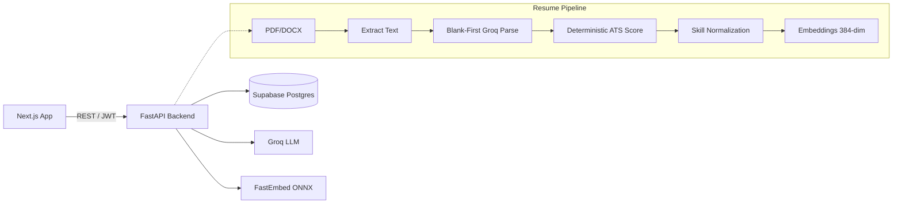

# Nexora: AI-Powered Talent Matchmaker


Nexora is an intelligent recruiting platform that evaluates candidates on substance over style. By leveraging deterministic ATS scoring, blank-first AI parsing, and a hybrid semantic matching engine, Nexora surfaces the best talent while remaining completely free to host and operate ($0 engineering).

[**Live Demo**](https://nexora-web-amber.vercel.app/)

**Demo Accounts (password: `password`):**
- Candidate: `demo-candidate@example.com`
- Recruiter: `demo-recruiter@example.com`

---

## 🏗 Architecture & Flow

Nexora orchestrates specialized pipelines to structure, score, and match unstructured data.



For the complete architectural snapshot, see [docs/ARCHITECTURE.md](docs/ARCHITECTURE.md).

## 🧠 Why Hybrid Ranking Beats Cosine

Nexora's matching engine uses a hybrid reranker combining pgvector cosine similarity, skill overlap, and experience fit. 

Here is the exact counter-example proven in our test suite (`test_matching_engine.py`):
> **The Job requires:** Python, FastAPI, PostgreSQL, Docker, Redis.
> **Candidate A** has all 5 skills. Pure cosine similarity scores them at `0.65`.
> **Candidate B** has only Python. Pure cosine similarity scores them at `0.88`.

A pure vector search would rank Candidate B higher despite them missing 80% of the required stack. Nexora's hybrid reranker scores Candidate A at **0.825** and Candidate B at **0.66**, correctly surfacing the candidate who actually fits the requirements. Substance over style.

## 📊 Explainable Scores

Every score in Nexora is deterministically calculated and fully transparent. There is no black-box AI matching. 


The deterministic ATS scorer evaluates resumes on strict rules (Contact completeness, Section presence, Quantified bullets, Skill bands, Length bands, Action verbs). The breakdown is permanently attached to the resume, proving exactly how the score was derived.

## 📄 Blank-First Parsing

Nexora's resume parsing operates on a strict "blank-first" policy. The system prompt and validation schemas explicitly enforce that if a field is not present in the resume, it must be returned as `null`. The AI is never allowed to hallucinate or invent missing data, ensuring total trust in the extracted profile.

## 💰 Runs on $0

Nexora is designed to run entirely on free-tier cloud services.

| Service | Free Tier Used | Constraint | Mitigation |
| :--- | :--- | :--- | :--- |
| **Vercel** | Next.js Frontend | Hobby limits | Edge caching and optimized static assets |
| **Render** | FastAPI Backend | Spins down after 15m | UptimeRobot ping every 5 mins (`/health`) |
| **Supabase** | DB, Auth, Storage | Pauses after 1 week | Ping `/health/db` before demos |
| **Groq** | Llama 3.3 70B | Rate limits (RPM/RPD) | SlowAPI rate limiter + aggressive caching |

## 🚀 Local Run Guide

Prerequisites: Node 20+, pnpm 9+, Python 3.11+.

### 1. Clone & Install
```powershell
git clone https://github.com/Kaavin-Khatri/Nexora.git
cd Nexora
pnpm install
```

### 2. Configure Environment
Copy `.env.example` to `.env` in `apps/api/` and `.env.local` in `apps/web/`. Fill in your Supabase and Groq keys.

### 3. Start the Backend
```powershell
cd apps/api
python -m venv .venv
.venv\Scripts\Activate.ps1
pip install -r requirements-dev.txt
cd ..\..
pnpm dev:api
```
*(The API runs on `http://localhost:8000`. The first request will download the 130MB embedding model.)*

### 4. Start the Frontend
In a new terminal:
```powershell
pnpm dev:web
```
*(The web app runs on `http://localhost:3000`.)*

---

## 💼 Resume Bullets

- *Built a hybrid semantic matching engine (pgvector HNSW + weighted skill-overlap reranker) serving explainable per-application score breakdowns.*
- *Engineered a deterministic ATS scoring pipeline using zero-shot LLM parsing with strict blank-first constraints to prevent hallucinated candidate data.*
- *Designed a $0-cost monorepo stack orchestrating a Next.js (React 19) frontend, a FastAPI backend, and an in-memory 384-dimensional ONNX embedding model.*
- *Implemented context-aware interview question generation by caching and diffing candidate resumes against job requirements via Groq.*
